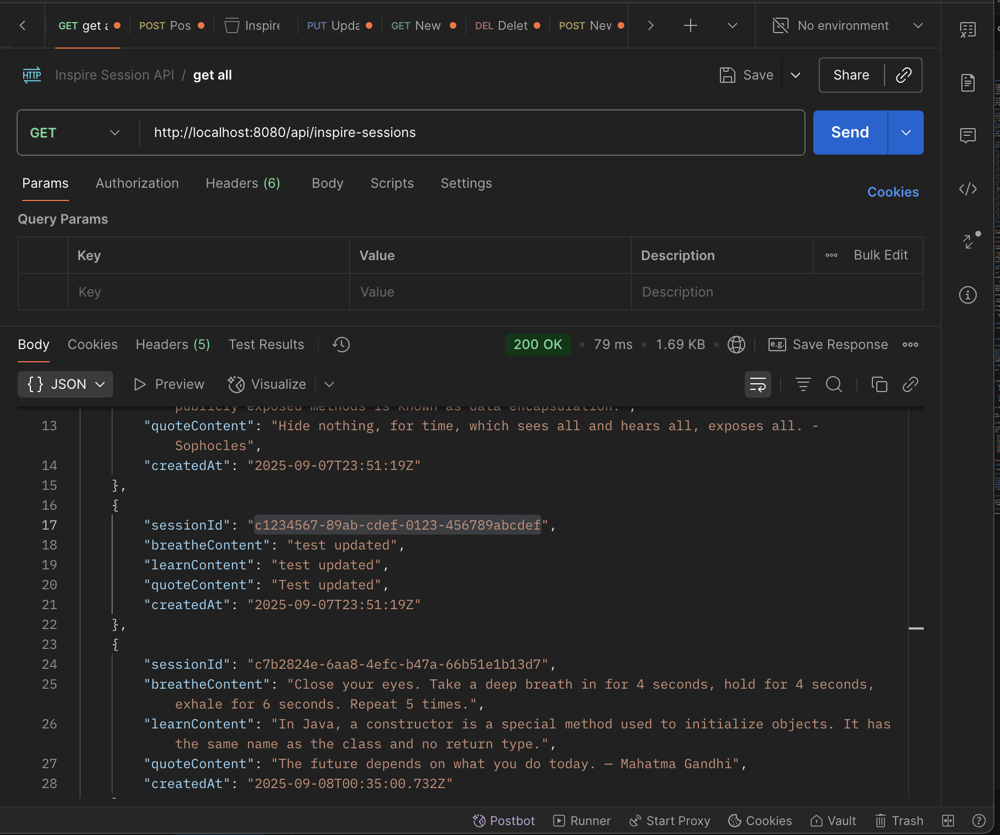

# Inspire API :leaves: 

Balancing a new job and daily commitments can make it challenging to stay engaged in the learning journey. This difficulty often heightens when faced with overwhelming work demands, personal challenges, or other stressors. This diminishes our focus, absorption of new information, and motivation. 

Inspire Api strives to find a solution for this problem by exploring ways to help users recenter themselves, spark curiosity, and promote continuous growth, especially during times of significant stress or mental fatigue.

## Inspire's approach:

   - **Breathe :wind_chime:** → We start with a short breathing exercise designed to help us slow down, be present, and shift out of a fight-or-flight state. This creates the mental space needed for learning.
   <br>
   - **Learn :books:** → Once we feel calmer and more receptive, we are presented with a brief and varied learning exercise. 
   <br>
   - **Quote :thought_balloon:** → We conclude with a reflective quote that encourages introspection. This quote helps us connect the new knowledge to our own lives and environments.

<br>
<!-- TABLE OF CONTENTS -->
<details>
  <summary>Table of Contents</summary>
  <ol>
    <li>
      <a href="#prerequisites">Prerequisites</a>
    </li>
    <li>
      <a href="#setup">Setup</a>
    </li>
    <li>
      <a href="#installation">Installation</a>
    </li>
    <li>
      <a href="#usage">Usage</a>
    </li>
    <li>
      <a href="#running-the-application">Running the Application</a>
    </li>
    <li>
      <a href="#api-endpoints-documentation">API Endpoints Documentation</a>
    </li>
    <li>
      <a href="#project-structure">Project Structure</a>
    </li>
    <li>
      <a href="#contributing">Contributing</a>
    </li>
    <li>
      <a href="#credits">Credits</a>
    </li>
    <li>
      <a href="#license">License</a>
    </li>
  </ol>
</details>

### <u>Prerequisites</u> :white_check_mark:

1. [JDK 21](https://learn.microsoft.com/en-gb/java/openjdk/download#openjdk-21) (or higher)

2. [Maven 3.9](https://maven.apache.org/download.cgi) (or higher)

3. [Git](https://git-scm.com/downloads)

4. [MySQL 8](https://dev.mysql.com/doc/refman/8.4/en/installing.html) (or higher)

5. [Visual Studio Code](https://code.visualstudio.com/Download)
    1. [Extension Pack for Java](https://marketplace.visualstudio.com/items?itemName=vscjava.vscode-java-pack)
    2. [Spring Boot Extension Pack](https://marketplace.visualstudio.com/items?itemName=vmware.vscode-boot-dev-pack)

### <u>Setup</u>
1. Clone the repository:

    `git clone https://github.com/Gwewe/inspire-api`

2. Navigate to the resources directory:

        cd InspireAPI/src/main/resources

3. Update `application.properties` file with the database configurations. Please note that the inspire_api_dump.sql is available in the InspireAPI folder for your consideration. 

   (optional) create a local properties for secure your credentials: 

   ```properties
   spring.datasource.username=your_username 
   
   spring.datasource.password=your_password
   ``` 
4. Configure your database:

    ```sql 
        CREATE DATABASE the_name_of_your_database_name; 
    ```

### <u>Installation</u>

5. To install dependencies:

         ./mvnw clean dependency:resolve


### <u>Usage</u>


### *Features*

- **GET all** and **GET by ID** for sessions and modules
- **POST** to create new sessions/modules
- **PUT** to update existing sessions/modules
- **DELETE** to remove sessions/modules
- UUID sessionId and moduleId are stored as `CHAR(36)` in MySQL
- OpenAPI/Swagger documentation available at `/api-docs`

### <u>Running the Application</u>

1. Start the application:

        ./mvnw spring-boot:run


2. Verify the creation of the inspire_sessions and modules tables:

    ```sql
        USE the_name_of_your_database;
        DESCRIBE inspire_sessions;
    ```

     ```sql
        USE the_name_of_your_database;
        DESCRIBE modules;
    ```

3. Use the Mysql dump file:

```
   mysql -u your_username -p the_name_of_your_database_name < inspire_api_dump.sql 
```

4. Use Postman to create a new report

Launch Postman if installed and send a POST request to your API endpoint:
```json
   {
      "breatheContent": "Close your eyes. Take a deep breath in for 4 seconds, hold for 4 seconds, exhale for 6 seconds. Repeat 5 times.",
      "learnContent": "In Java, a constructor is a special method used to initialize objects. It has the same name as the class and no return type.",
      "quoteContent": "The future depends on what you do today. — Mahatma Gandhi"
   }
```

### Postman



---
### <u>Contributing</u>

Thank you for considering contributing to this project! 

### How to Contribute

1. **Fork** the repository to your GitHub account.
2. **Create** a new branch for your feature or bug fix.
3. **Commit** your changes.
4. **Push** your branch to your forked repository.
5. **Open** a pull request from your branch to the main repository's `main` branch.


### <u>Credits</u> :leaves:

- Wedna G: Lead Developer
- Inspire API: API used to fetch and manage inspire sessions with the three modules (Breathe, Learn, and Quote).

### <u>License</u>

The Report API project is licensed under the MIT License.

